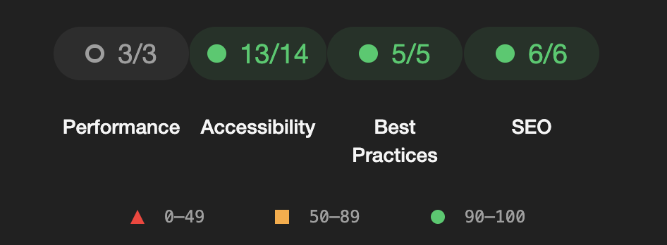

<h1>Kodizim QR Order System</h1>

### 🪄  You can access the order application by scanning the qr code.


### 🔗 Design


### Try running some of the following tasks:
```shell
git clone https://github.com/fport/qr-order.git
cd qr-order
yarn install
yarn dev
```

<h2>Target</h2>

- Link redirection with qr menu
- Add product remove
- Order detail
- Sending an Order
- Order Panel
.....
  
<h2>🎉 Performance Testing</h2>



# ToDo's
- We must change json data to excel db
